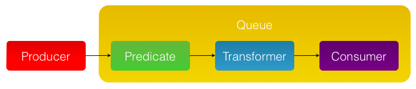
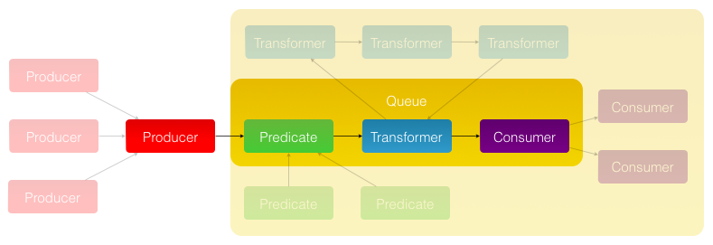

Objective-Chain
===============

Object-oriented reactive framework written in **Objective-C**, that abstracts _production_, _transformation_ and _consumption_ of values in a declarative way.

Project is inspired by [ReactiveCocoa](https://github.com/ReactiveCocoa/ReactiveCocoa), but takes more object-oriented approach.

Aim is to build reusable and scalable solution for **MVVM** bindings.

##### Project is in early stages of development. Everything you see here can change at any point in time. Follow the [Roadmap](https://github.com/iMartinKiss/Objective-Chain/issues/1) for progress. Thanks!

Intro
-----

Everything happens for a reason and this is especially true in software. Basic principle of software is to receive input and provide output. **Reacting to events with actions**, but our actions can trigger new events. A reactive framework should allow you to write the rules declaratively. This means you **write it once and it works forever** (or at least until cancelled).

In iOS and OS X applications, we know multiple way to react on events: *Target + Action*, *Notifications*, *Key-Value Observing*, *Delegation* and *Blocks*. All of them have **different characteristics** and therefore they are used in different cases and using different APIs. Objective-Chain attempts to **unify these callback mechanisms** and allows you to easily receive events, filter or transform their values and subsequently execute actions or chain them to other events.

#### Event vs. Value

To avoid confusion, we should clarify the difference between *Event* and *Value*. The difference, for purpose of Objective-Chain, **is none**. Producing a *Value* is an *Event* and *Events* usually have some *Value* associated with them. And if not, *No Value* is still a *Value*.

Concept
-------

Core concept is really simple as this is one of the objectives. There are ***Producers*** that produce values and ***Consumers*** that consumes them. We connect these two objects using ***Connections***.

  - **`OCAProducer`** is an abstract class that you can subclass or use one of the provided concrete implementations: `OCACommand`, `OCATimer`, `OCANotificator`, `OCAProperty`, `OCABridge`, `OCAHub` and more. *Producer* can send values to multiple *Connections*.
  - **`OCAConsumer`** is a protocol that you can implement or customize some provided generic block implementation in a form of `OCASubscriber`.
  - **`OCAConnection`** is class that takes values from one *Producer* and pass them to one *Consumer*. In addition, a *Connection* can have associated filter *Predicate*, value *Transformer* and *Queue* on which it should deliver the results.
      - `NSPredicate` class is used to filter values. Only objects that evaluate to `YES` are passed to *Consumer*.
      - `NSValueTransformer` class (and customizable `OCaTransformer` class) is used to transform objects for *Consumer* after they passed *Predicate*.
      - `OCAQueue` is a simple, but powerful wrapper for GCD queues. It makes multithreading with Objective-Chain a fun.

### Composition

The fundamental principle of Objective-Chain is ability to **compose objects of the same kind** and this is true for all parts of the *Connection*.

Despite of the fact, that single *Connection* can have associated only one *Producer*, one *Queue*, one *Predicate*, one *Transformer* and one *Consumer*, with composition the possibilities are endless:

  - ***Producer*** – merge or combine multiple using `OCAHub` (which is again a *Producer* subclass). Keep in mind, that any *Producer* can send values to multiple *Connections*.
  - ***Queue*** – each *Queue* must have a target *Queue* (with exception of *Main* and *Background* queues). Custom queues are targeted to *Background* queue by default.
  - ***Predicate*** – combine them using `NSCompoundPredicate` or using convenience factory class `OCAPredicate`.
  - ***Transformer*** – sequence them, repeat them or make logical decisions of which transformer to use. This all is provided using `OCATransformer` class and its factory.
  - ***Consumer*** – forward values to multiple consumers using `OCAMulticast` (which is again a *Consumer*). *Consumers* can technically receive values from multiple *Connections*, but this is not used very much.
  
  - ***Connection*** – chain and branch multiple *Connections* using ***Bridges***. *Bridge* is a *Producer* **and** *Consumer*. The simplest `OCABridge` produces consumed values. More advanced *Property Bridge* produces values based on KVO notifications and consumes them using KVC setters.

## [Modules](./Sources)

**Objective-Chain** is made up of *Core* and additional libraries that are built on top of it. 

Basic library ***Foundation*** provides transformers for many standard classes like `NSArray`, `NSDictionary`, `NSString` or `NSNumber`, and also implements *Timer* and *Notification* producers. ***Geometry*** library makes it easy to work with frames, insets or transforms. [Read more…](./Sources)

More modules will be added, mainly **UIKit** additions.

---

Licensed under The MIT License (MIT)  
Copyright © 2014 Martin Kiss
